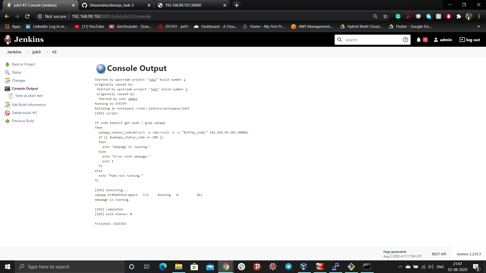

## Automation using Kubernetes(Intergrating with Jenkins, Docker and Github)
*This project has been created to deploy a docker container using Dockerfile. The deployed container has pre-installed and configured Jenkins, Git, Java and all the required packages(.rpm). Jenkins will deploy a pod with configured O.S environment(for html page, httpd image) as soon as developer will update the code in the github repository.*

### Problem Statement:
```
1. Create container image that’s has Jenkins installed  using dockerfile or You can use the Jenkins Server on RHEL 8/7
2. When we launch this image, it should automatically starts Jenkins service in the container.
3. Create a job chain of job1, job2, job3 and  job4 using build pipeline plugin in Jenkins 
4. Job1 : Pull  the Github repo automatically when some developers push repo to Github.
5. Job2 : 
    5.1. By looking at the code or program file, Jenkins should automatically start the respective language interpreter installed image container to deploy code on top of Kubernetes( eg. If code is of  PHP, then Jenkins should start the container that has PHP already installed )
    5.2. Expose your pod so that testing team could perform the testing on the pod
    5.3. Make the data to remain persistent ( If server collects some data like logs, other user information )
6. Job3 : Test your app if it  is working or not.
7. Job4 : if app is not working , then send email to developer with error messages and redeploy the application after code is being edited by the developer
```
### Prerequisite:
System has to be pre-configured with docker, Jenkins, Git, Kubernetes.

### Detail setup of the environment:
- Create a Dockerfile in the separate directory to setup the container environment
```
FROM centos:latest

RUN yum install sudo -y
RUN yum install wget -y
RUN yum install git -y
RUN yum install net-tools -y
RUN sudo wget -O /etc/yum.repos.d/jenkins.repo https://pkg.jenkins.io/redhat-stable/jenkins.repo
RUN sudo rpm --import https://pkg.jenkins.io/redhat-stable/jenkins.io.key
RUN yum install java-11-openjdk.x86_64 -y
RUN yum install jenkins -y
RUN yum install /sbin/service -y
RUN yum install openssh-server -y
RUN echo "jenkins ALL=(ALL) NOPASSWD:ALL" >> /etc/sudoers
CMD sudo service jenkins start -DFOREGROUND && /bin/bash
CMD java -jar /usr/lib/jenkins/jenkins.war
EXPOSE 8080
```
To create the custom image, run the following command from the directory containing Dockerfile

- To provide tag to the image use -t
- Jenkins:v1, Jenkins is the image name and v1 is the version of the image
- Dot(.) represent the current working directory
```
docker build -t Jenkins:v1 .
```

After creating the image launch the container from the custom image, Jenkins:v1
- To run the container in the detached mode with interactive terminal use (-dit)
- 8082 is the exposed port to achieve NAT and 8080 is the port where jenkins is running inside the container, (-p) to specify port
- (--name) to provide name to the container
- Jenkins:v1 is the created custom image
```
docker run -dit -p 8081:8080 --name my_os Jenkins:v1
```

Now, as one launches the jenkins running inside the container at port 8081, it requires password to login to the Jenkins dashboard
```
docker exec -it my_jenkins bash
cat /root/.jenkins/secrets/initialAdminPassword
```
Login to the Jenkins dashboard and change the admin password as per the requirement.

Now, install some required plugins to achieve the task from **manage jenkins -> manage plugins**
- Github
- SSH
- Build Pipeline
- Email Extension

**Job1:** This job will download the code as soon as developer commit the code in the github repository.

- Configuration of the Job1 in the jenkins:


```
cp -rvf * /root/dev_ops
```
- Output console of the Job1


- Setting up the execution of the shell script on remote host using ssh


**Job2:** This job will launch the pod using webserver.yml configuration file by analysing the code according to the extension(seperate pod for .html and .php file).
- Configuration of the Job2 in the jenkins:


```
if sudo ls /root/devops | grep .html
then
  if sudo kubectl get deployment | grep webserver
  then
    echo " Deployment of pods already done."
  else
    sudo kubectl create -f /root/webserver.yml
    sleep 30
    if kubectl get pods | grep webapp
    then
      pods=$(sudo kubectl get pods -o=name | grep webapp | sed "s/^.\{4\}//")
      sudo kubectl cp /root/devops/index.html $pods:/usr/local/apache2/htdocs/
    else
      echo "Web-code not copied"
    fi
  fi
else
  echo "HTML code not found"
fi
```
- Configuration of webserver.yml file
```
apiVersion: v1
kind: Service
metadata:
  name: webapp
  labels:
    app: webapp
spec:
  ports:
    - port: 80
      nodePort: 30000
  selector:
    app: webapp
    tier: frontend
  type: NodePort
---
apiVersion: v1
kind: PersistentVolumeClaim
metadata:
  name: webapp-pv-claim
  labels:
    app: webapp
spec:
  accessModes:
    - ReadWriteOnce
  resources:
    requests:
      storage: 10Gi
---
apiVersion: apps/v1 # for versions before 1.9.0 use apps/v1beta2
kind: Deployment
metadata:
  name: webapp
  labels:
    app: webapp
spec:
  selector:
    matchLabels:
      app: webapp
      tier: frontend
  strategy:
    type: Recreate
  template:
    metadata:
      labels:
        app: webapp
        tier: frontend
    spec:
      containers:
      - image: httpd
        name: webapp
        
        ports:
        - containerPort: 80
          name: webapp
        volumeMounts:
        - name: webapp-persistent-storage
          mountPath: /usr/local/apache2/htdocs/
      volumes:
      - name: webapp-persistent-storage
        persistentVolumeClaim:
          claimName: webapp-pv-claim
```
- Output console of the Job2


**Job3:** This job will identify whether the deployed website is running fine or not. If any error occured then it will mail the recipient e-mail address.
- Configuration of the Job3 in the jenkins:
```
if sudo kubectl get pods | grep webapp
then
  webapp_status_code=$(curl -o /dev/null -s -w "%{http_code}" 192.168.99.101:30000)
  if [[ $webapp_status_code == 200 ]]
  then
    echo "Webpage is running."
  else
    echo "Error with webpage."
    exit 1
  fi
else
  echo "Pods not running."
fi
```


- Setting up the E-mail notification on unsucessful build of the job.


- Output console of the Job3



### Pipeline view of the created Jobs related to the project:


### Resources launched on the kubernetes:
- kubectl get all(to get all the resources)
- kubectl get all pvc(list of all the persistent volume claim created)


- Webpage hosted on the httpd pod


#### Finally automation using kubernetes is achieved.
